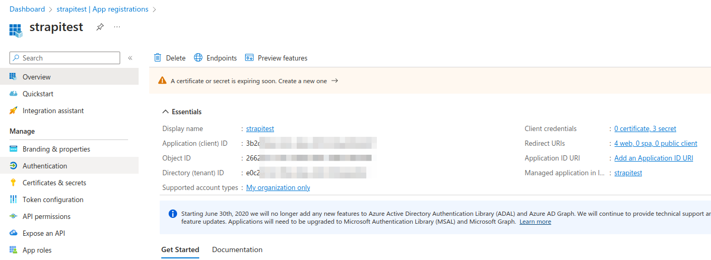
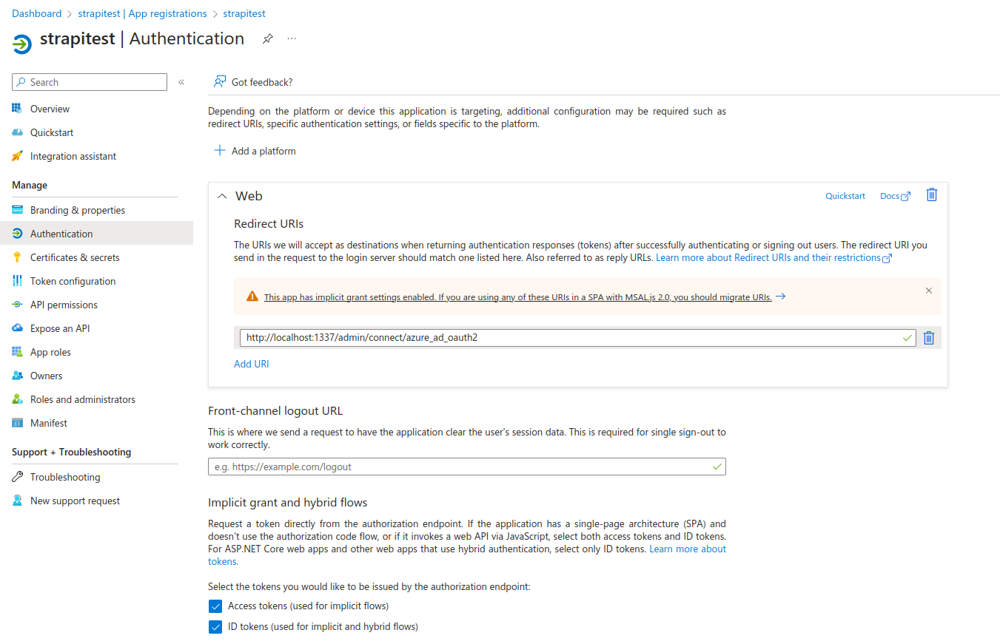
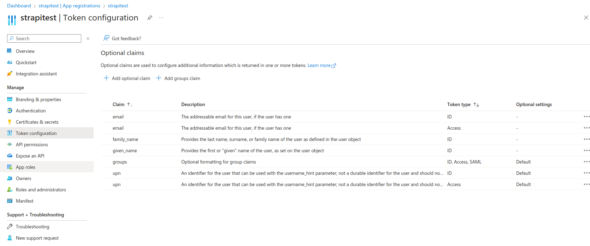
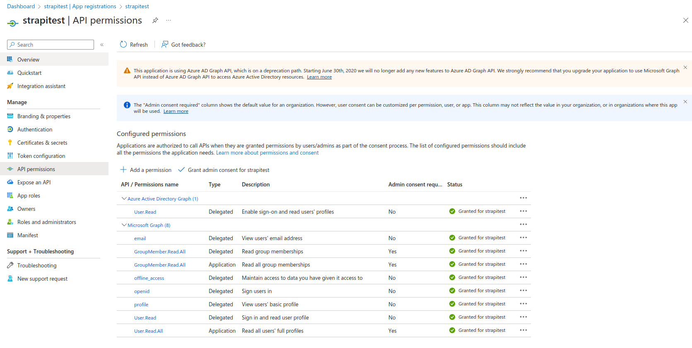

# Strapi Example - Azure AD group sync

This is an example of how to sync Azure AD groups to Strapi using the [Azure AD Graph API](https://docs.microsoft.com/en-us/azure/active-directory/develop/active-directory-graph-api).

Using the Graph API from Microsoft, we can search the Azure AD for groups and users. We can then use this information to set (or create) groups in Strapi and assign users to these groups.

## How this works

We of course need to configure the Azure AD OAuth2 sign-in, however since that does not allow setting groups we need to fetch additional information from the Graph API. This is done by creating a custom service that can be called in some of the authentication lifecycles.

The service will query the Azure AD users (in this example via the `otherMails` attribute), fetch the groups that user is a member of, find those groups within Strapi and assign the user to those groups.

The base logic of the SSO configuration can be found in [./config/admin.js](./config/admin.js), within this file we configure SSO and also where the service is called within the [onConnectionSuccess](https://docs.strapi.io/dev-docs/configurations/sso#authentication-events) lifecycle.

Then a [custom service](./src/api/azureGroupSync/services/sync.js) is created that handles all of the Microsoft Graph API logic.

A lot of this logic would need to be customized to fit your exact need and requires some knowledge of the Microsoft Graph API as well as the app registration in Azure AD.

For the sake of sharing this information below are some of the configurations applied to my Azure AD App, not all of these are required and you should do your research to ensure you have a proper configuration for your environment.

### Base app

### Authentication

### Token Configuration

### API Permissions

